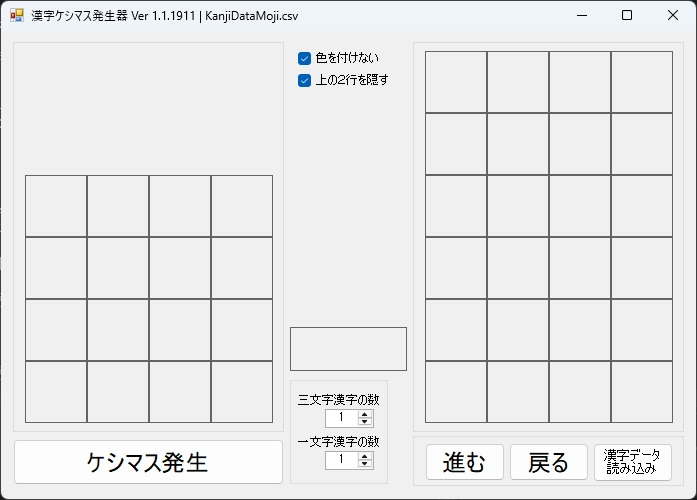
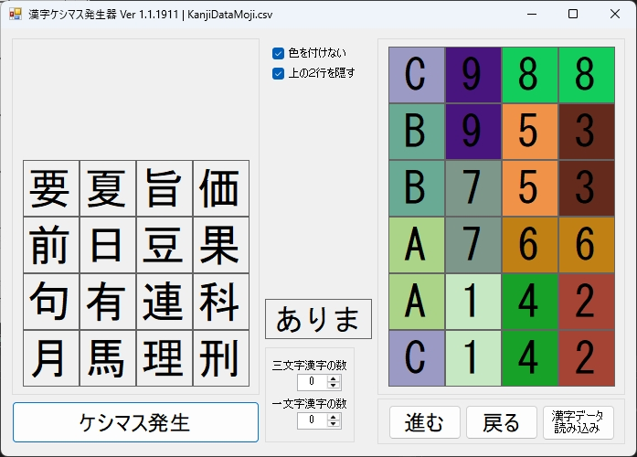
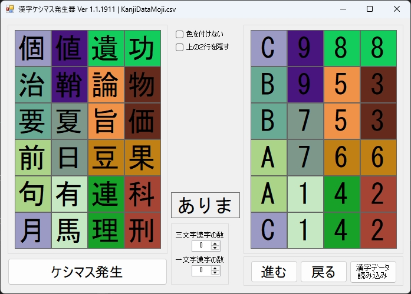
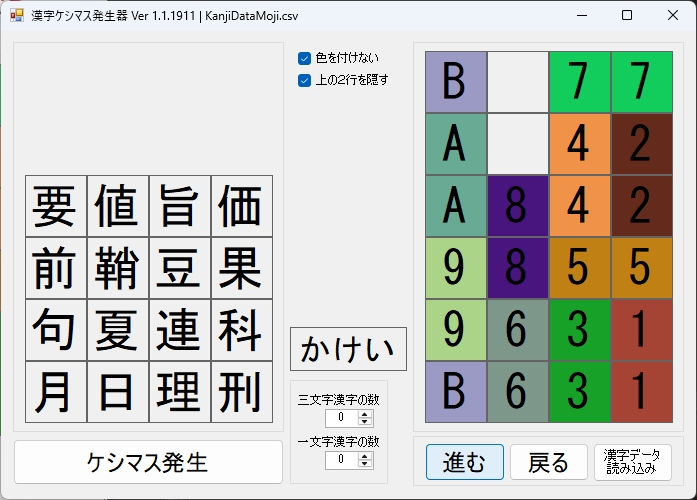
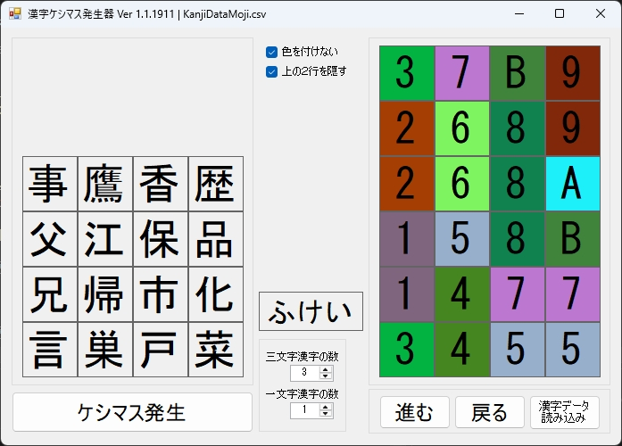

# 漢字ケシマスの生成プログラム

実行時には、dataフォルダ内の「KanjiDataMoji.csv」ファイルをexeファイルと同じフォルダに置いてください。

## 簡単な説明

実行すると以下のような画面がでます。左の4x4マスがケシマスの問題画面です。右の4x6が正解画面です。

発生させる漢字の文字数の組み合わせを、中央の「一文字の漢字」「三文字の漢字」の数を指定します。残りの数が二文字の漢字の数になります。

どちらも 0 にすると、二文字の漢字のみで問題が生成されます。

「二文字の漢字」だけで、問題を生成しました。「ケシマス発生」ボタンを押すと、ランダムに漢字が選ばれて問題が生成されます。

「色を付けない」「上の２行を隠す」チェックを外すと、漢字が右の正解と同じ色塗りになるので、分かりやすくなります。

「進む」ボタンを押すと、1番が振られている漢字が消えて、上から漢字が落ちてきます。「進む」を押せば正解回答が続き、最終的にすべての漢字が消去されます。

以下は、「３文字の漢字」を3つと「１文字の漢字」を 1つ含む問題を生成した例です。

